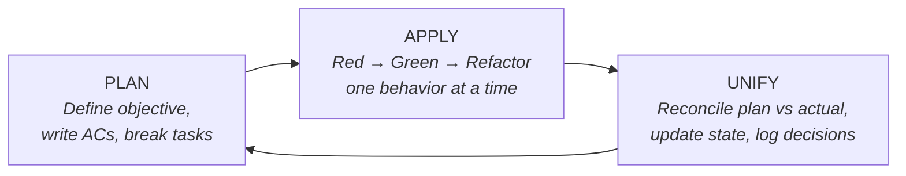

# Lean Loop

[](LICENSE)
[](https://opencode.ai)

A disciplined heartbeat cycle for AI-assisted and human-driven TDD development.

```
    PLAN ──────► APPLY ──────► UNIFY
     ▲                              │
     └──────────────────────────────┘
```

## Why Lean Loop?

AI coding assistants are powerful but chaotic. They write code fast, skip tests, lose context, and rarely reconcile what was planned vs. what was built. Lean Loop fixes that with three simple rules:

- **Plan before you code.** Define acceptance criteria before touching any file.
- **Test every behavior.** Strict Red-Green-Refactor, one test at a time.
- **Reconcile every cycle.** Compare plan vs. actual, log decisions, update state.

The result: predictable, auditable, test-covered development — whether you're working solo, with a team, or alongside an AI.

## Quick Start

### Install as an opencode skill

```bash
npx skills add oxyplay/lean-loop -g
```

The skill auto-creates `.system/` tracking files in your project on first use.

### Manual setup

```bash
cp -r .system/ /path/to/your/project/.system/
```

### Your first loop (60 seconds)

1. Open `.system/PLAN.md` and write:
   - **Objective:** "Add a `greet(name)` function that returns `Hello, {name}!`"
   - **AC:** `Given name="World", When greet() called, Then returns "Hello, World!"`
2. Open `.system/TDD_RULES.md` — follow Red-Green-Refactor
3. Write one failing test → make it green → refactor
4. Open `.system/STATE.md` — update phase, log what you did, set next action
5. Repeat

## The Heartbeat

Operational state lives in the `.system/` folder.



### Phase 1: PLAN

Fill in `.system/PLAN.md` with objective, Given/When/Then acceptance criteria, boundaries, and task breakdown.

> **Gate:** If ACs are unclear, contradictory, or untestable — stop and refine. Do not proceed to APPLY.

### Phase 2: APPLY

Execute Red-Green-Refactor cycles strictly:

1. **RED** — Write ONE failing test. Confirm with actual console output.
2. **GREEN** — Minimal code to pass. No future-proofing.
3. **REFACTOR** — Improve design only when green.

> **Rule:** If work expands beyond original ACs — stop and return to PLAN.

### Phase 3: UNIFY

Mandatory reconciliation after every APPLY session:

1. All tests green? Run the full suite.
2. All ACs satisfied? Check each one explicitly.
3. Update `.system/STATE.md` with current phase and next action.
4. Log decisions and debt in `.system/LOG.md`.
5. Compare planned vs. actually done.

```
- **Planned:** [what you set out to do]
- **Actually done:** [what changed]
- **AC satisfied:** [each AC and whether met]
- **Deferred / Debt:** [if any]
- **Next Action:** [exactly one task]
```

## Project Structure

```
your-project/
├── .system/
│   ├── PLAN.md          # Active plan with ACs and tasks
│   ├── STATE.md         # Current phase, next action, backlog
│   ├── LOG.md           # Decisions, debt, and failure log
│   └── TDD_RULES.md     # Red-Green-Refactor execution rules
└── ...
```

## Philosophy

- **In-Session Context** — All work happens in the main session. No subagent handoffs during implementation.
- **Vertical Slicing** — Build one behavior end-to-end (Tracer Bullets), not horizontal layers.
- **Acceptance-Driven** — Define "Done" via clear criteria before writing code.
- **Behavior-First TDD** — Test public interfaces, not internal implementation.
- **Deep Modules** — Small public interfaces that hide complex internals.

## When to Break TDD

Rare exceptions, all must be logged in `.system/LOG.md`:

- **Hotfixes** — production bugs requiring immediate recovery
- **Legacy Code** — too tightly coupled for test-first approach
- **Spikes** — exploratory code, will be thrown away

## Examples

Each example includes real `.system/` files showing the exact state after PLAN, APPLY, and UNIFY phases.

| Example | Stack | What it builds |
|---------|-------|---------------|
| [greet(name)](examples/todo-cli/) | Node.js | Simple function — your first loop |
| [POST /api/todos](examples/rest-api/) | Express + Jest | REST endpoint with validation |
| [Toggle component](examples/react-component/) | React + RTL | Accessible UI component |

Browse all: [`examples/`](examples/)

## Integrations

Lean Loop works with any AI coding tool. Drop-in configs for your stack:

| Tool | Setup | File |
|------|-------|------|
| **opencode** | `npx skills add oxyplay/lean-loop -g` | [SKILL.md](skills/lean-loop/SKILL.md) |
| **Claude Code** | Copy `CLAUDE.md` to project root | [integrations/claude-code/](integrations/claude-code/) |
| **Cursor** | Copy `.cursorrules` to project root | [integrations/cursor/](integrations/cursor/) |

See [`integrations/`](integrations/) for setup instructions.

## FAQ

**Q: Do I need opencode to use this?**
A: No. The `.system/` templates work with any editor. The opencode skill just auto-initializes them.

**Q: Can I use this with my team?**
A: Yes. Commit `.system/` to your repo. Everyone shares the same plan, state, and decision log.

**Q: What if my project already has tests?**
A: Lean Loop works alongside existing test suites. Use it for new features and incremental improvements.

**Q: Is this only for AI-assisted development?**
A: No. The PLAN → APPLY → UNIFY cycle works for human-only teams too. AI just makes the discipline easier to maintain.

## References

- [The Pragmatic Programmer](https://pragprog.com/titles/tpp20/) — Tracer Bullets concept
- [A Philosophy of Software Design](https://www.amazon.com/Philosophy-Software-Design-John-Ousterhout/dp/1732102201) — Deep Modules
- [Test-Driven Development: By Example](https://www.amazon.com/Test-Driven-Development-Kent-Beck/dp/0321146530) — Kent Beck's TDD approach

## Contributing

See [CONTRIBUTING.md](CONTRIBUTING.md) for guidelines.

## License

[MIT](LICENSE) © 2026 Max
